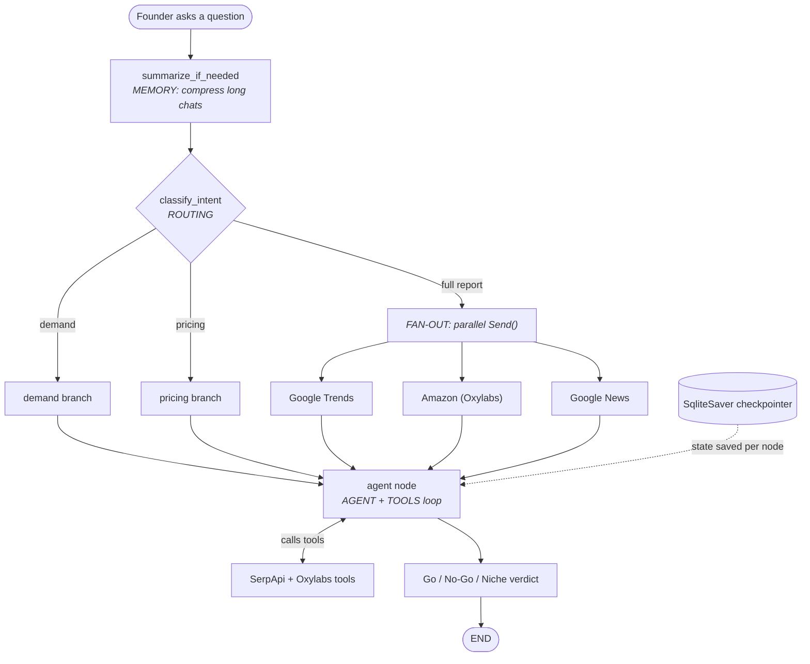

# LaunchLens 🔭

A CLI chat agent that tells a founder whether a product is worth launching. You type a
product idea in plain English; LaunchLens researches it live — **demand** from SerpApi
(Google Trends, Shopping, News) and **supply** from Oxylabs (Amazon search, product,
reviews) — fuses both sides, and replies with a **Go / No-Go / Niche** verdict covering
demand, price band, and positioning. It remembers the conversation across turns and
summarizes once it gets long.

> 📄 The full assignment brief lives in **[README-brief.md](./README-brief.md)** and the
> hosted landing page: https://fnusatvik07.github.io/agentbuilder-assignment3/

---

## Setup

Requires Python 3.12+ and [`uv`](https://docs.astral.sh/uv/).

```bash
# 1. Install dependencies into a local venv
uv venv
uv sync

# 2. Configure keys (mock mode needs none)
cp .env.example .env
# edit .env — set LLM_PROVIDER and any API keys you have

# 3. Run the chat loop
uv run launchlens
# or: uv run python cli.py

# 4. (Optional) Run with debug trace — step through each graph node
uv run launchlens --debug
# or: uv run python cli.py --debug
```

### Environment variables (`.env`)

| Variable            | Purpose                                          |
|---------------------|--------------------------------------------------|
| `LLM_PROVIDER`      | `mock` \| `openai` \| `anthropic` (default `mock`) |
| `SERPAPI_KEY`       | SerpApi key — demand data                        |
| `OXYLABS_USER`      | Oxylabs username — supply data                   |
| `OXYLABS_PASS`      | Oxylabs password — supply data                   |
| `OPENAI_API_KEY`    | Required when `LLM_PROVIDER=openai`              |
| `ANTHROPIC_API_KEY` | Required when `LLM_PROVIDER=anthropic`          |
| `LAUNCHLENS_DEBUG`  | Set to `1` to enable debug trace (alt: `--debug`) |

> **Mock mode** (`LLM_PROVIDER=mock`) needs no keys: every tool loads from `fixtures/`
> and a fake LLM drives the conversation. Use it to develop and demo offline.

> **Debug mode** — Pass `--debug` (or set `LAUNCHLENS_DEBUG=1` in `.env`) to stream
> each graph node and its state delta before the verdict. Press Enter to advance,
> type `a` to auto-advance remaining steps. Useful for learning how LangGraph executes.

---

## Web UI — LangGraph execution viewer

There are **two front-ends over the same compiled graph**: the CLI above, and a
LangSmith-style web viewer that *watches* the graph run — node-by-node execution,
the parallel fan-out, tool calls + slim results, routing decision, live state, and
SqliteSaver checkpoints. The web layer (`launchlens/api/`) changes nothing about
the graph itself.

Run it as **two processes** (mock mode needs no keys):

```bash
# 1. Backend — FastAPI + SSE, from the repo root
uv sync                         # picks up fastapi / uvicorn / sse-starlette
uv run launchlens-api           # serves http://127.0.0.1:8000

# 2. Frontend — Vite dev server, in a second terminal
cd frontend
npm install
npm run dev                     # serves http://localhost:5173
```

Then open **http://localhost:5173**.

> ⚠️ Use `localhost`, **not** `127.0.0.1`, for the frontend — Vite binds IPv6 on
> some Windows setups. Vite proxies `/api/*` to the backend, so there's no CORS
> setup needed in dev, and you only need the backend running for the UI to work.

What each panel shows (maps 1:1 to the graded concepts):

| Panel | Concept |
|---|---|
| **Graph** (left) | Typed `StateGraph` topology + **fan-out** (the 5 research nodes light up together in one superstep) |
| **Inspector** tab | Node timeline, durations, per-node **state deltas** |
| **Tools** tab | Each tool call + its slim `<200 B` result (demand vs supply colour-coded) |
| **State** tab | Live `intent` (**routing**), merged `research` dict (`operator.or_`), message count |
| **Memory** tab | **SqliteSaver checkpoints** written per superstep |
| **Chat** (right) | Transcript + input; memory persists per `thread_id` |

**Quick smoke test without a browser** (with the backend running):

```bash
curl http://127.0.0.1:8000/api/config
curl -N -X POST http://127.0.0.1:8000/api/chat \
  -H "Content-Type: application/json" \
  -d '{"question":"should I launch a steel water bottle?","thread_id":"demo"}'
```

You should see a stream of `node_start` / `tool_end` / `routing` / `final` SSE
events. More detail in [`frontend/README.md`](./frontend/README.md).

> In **mock mode** the agent's *internal* tool loop is silent (the fake LLM never
> calls tools), so the reliable tool trace is the fan-out research nodes — which
> show all 5 real calls with live outputs. Switch to `openai`/`anthropic` to see
> the agent node call tools too.

---

## Concept map (the 5 graded LangGraph concepts)

Each required concept maps to a file + function + line. See
[`CONCEPT_MAP.md`](./CONCEPT_MAP.md) for the full per-symbol breakdown.

| # | Concept                       | File                              | Function / symbol            | Line |
|---|-------------------------------|-----------------------------------|------------------------------|------|
| 1 | Typed `StateGraph` + reducers | `launchlens/graph.py`             | `LaunchLensState` (`operator.or_` on `research`) | 55, 69 |
| 2 | Fan-out (parallel `Send()`)   | `launchlens/graph.py`             | `route_by_intent` / `Send`   | 151, 160 |
| 3 | Routing (conditional edges)   | `launchlens/graph.py`             | `classify_intent` / `add_conditional_edges` | 106, 264 |
| 4 | Agent node + tools            | `launchlens/graph.py`             | `create_react_agent` agent node | 206, 226 |
| 5 | Short-term memory             | `launchlens/memory.py`, `graph.py`| `SqliteSaver`, `summarize_if_needed` | 34, 77 |

Tools wrapped for the agent node:

- **SerpApi (demand)** — `launchlens/tools/serpapi_tools.py`: Google Trends, Shopping, News
- **Oxylabs (supply)** — `launchlens/tools/oxylabs_tools.py`: Amazon search, product, reviews

Every tool returns a slim dict (<200 bytes); raw API responses are never passed to the LLM.

---

## Architecture



A live diagram can be regenerated with `graph.get_graph().draw_mermaid()`.

---

## Demo script

Run `uv run launchlens` and try a conversation that shows fusion and memory across turns:

1. `I want to launch a stainless-steel insulated water bottle in India under ₹1,500 — is it worth it?`
2. `What are people complaining about in the reviews of the top sellers?`
3. `What about the US market instead?`  ← *tests memory: it should keep the bottle context*
4. `Compare it with a cheaper plastic version.`
5. `Give me the final Go/No-Go verdict with a price band and positioning.`
6. `Summarize everything we've discussed.`  ← *exercises the summarization node*

---

## Project layout

```
launchlens/
  config.py        # 3-mode LLM switcher (mock | openai | anthropic)
  graph.py         # LangGraph state machine (all 5 concepts)
  memory.py        # SQLite checkpointer
  debug.py         # Rich step-through trace for the CLI
  tools/
    serpapi_tools.py   # demand: Trends, Shopping, News
    oxylabs_tools.py   # supply: Amazon search, product, reviews
  api/             # web layer over the same graph (no graph changes)
    server.py          # FastAPI: config, topology, chat (SSE), threads
    streaming.py       # graph event stream -> SSE events
    serializers.py     # LangChain messages/state -> JSON
fixtures/          # mock JSON, one file per API source
cli.py             # Rich terminal UI, entry point
frontend/          # React + TS + Tailwind execution viewer (see its README)
```
